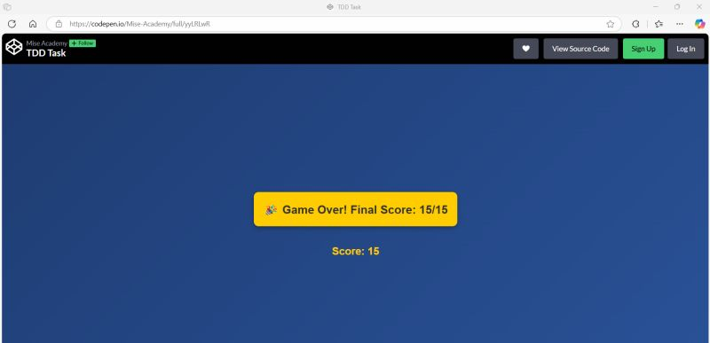
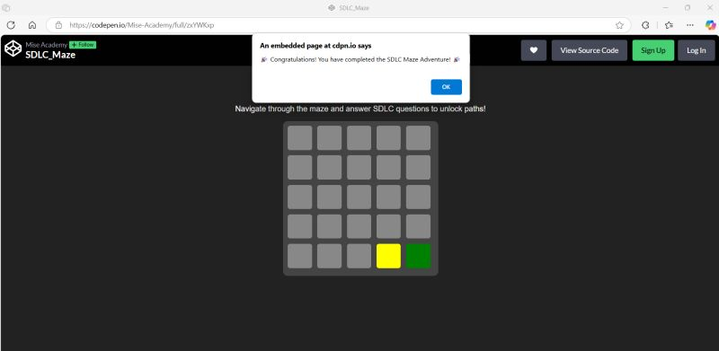

# Class Activities Showcase - TDD & SDLC Maze

Welcome to the demonstration of the activities completed as part of our learning journey through TDD (Test-Driven Development) and the Software Development Life Cycle (SDLC). Below are screenshots and brief descriptions of the tasks successfully accomplished.

---

## ✅ TDD Task Completion

We engaged in a Test-Driven Development activity where we solved programming challenges incrementally by writing tests first. Here's the final result showing a perfect score:

**Final Score:** 15/15  
**Status:** Game Over – All challenges completed successfully!

---

## 🧭 SDLC Maze Adventure

This task involved navigating a maze by answering SDLC-related questions correctly to unlock the next path. We successfully completed the entire maze.

**Status:** Maze Completed – All questions answered correctly!

---

## 📝 Supporting Notes

A class PDF document was provided, summarizing key concepts from the TDD and SDLC topics. It includes:
- Core principles of Test-Driven Development
- SDLC phases overview (Planning, Analysis, Design, Implementation, Testing, Deployment, Maintenance)
- Sample questions and answers used in the maze activity

These notes helped reinforce the theory behind the interactive exercises.

---

### 📁 Repository Contents

- `README.md` – This file.
- `image1.png` – Screenshot of completed TDD task.
- `image.png` – Screenshot of completed SDLC Maze.

---

Feel free to explore and learn along!
