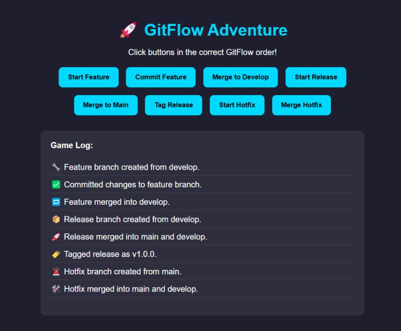
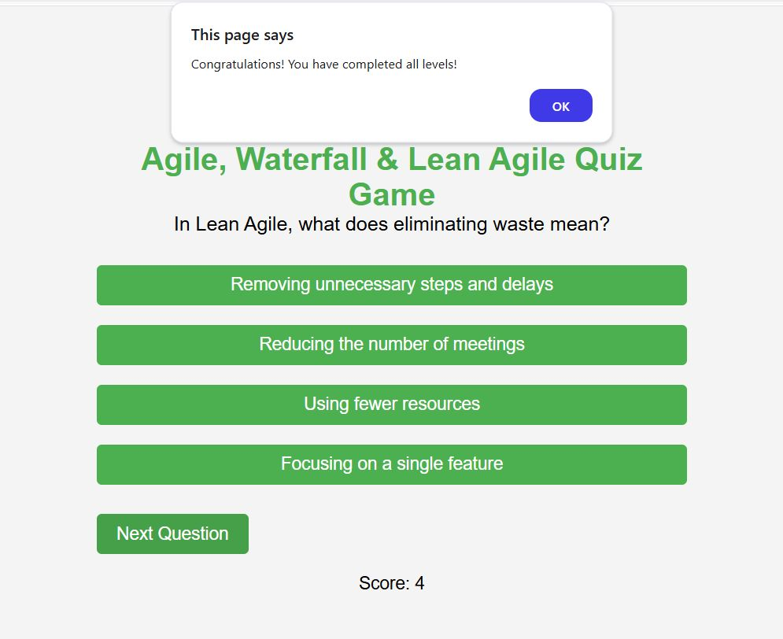

# 🚀 Class 11  Activity: GitFlow & Agile Games

This folder contains interactive class activities and learning materials related to GitFlow and Agile methodologies.

## 🧩 GitFlow Adventure

We played an interactive **GitFlow Adventure** game where we had to perform Git actions in the correct sequence. The activity helped us solidify our understanding of the GitFlow branching model including:

- Starting and completing feature branches
- Merging to develop
- Creating release branches
- Tagging releases
- Handling hotfixes

📸 Screenshot:

👉 [Play GitFlow Adventure](./game.html)

## 🧠 Agile, Waterfall & Lean Agile Quiz Game

We also participated in a quiz game on **Agile, Waterfall, and Lean Agile** principles. The quiz tested our understanding of:

- Agile methodologies
- Lean thinking (e.g., eliminating waste)
- Waterfall model vs Agile practices

🎯 Final Score Screenshot:

👉 [Play Agile, Waterfall & Lean Agile Quiz Game](./agile-quiz-game.html)

## 📄 Summary

The `Class-11` provides a brief theoretical overview of GitFlow, Agile, Waterfall, and Lean methodologies. It includes:

- Key principles of Agile and Lean
- GitFlow process diagrams
- Comparison between Agile and Waterfall

## 📂 Files Included

- `game.html`: Interactive GitFlow game
- `Agile vs Waterfall.html`: Agile methodologies quiz game
- `image1.png`: GitFlow Adventure screenshot
- `image.png`: Agile Quiz Game screenshot

---

✅ This exercise was a fun and interactive way to reinforce key software development workflows and methodologies!