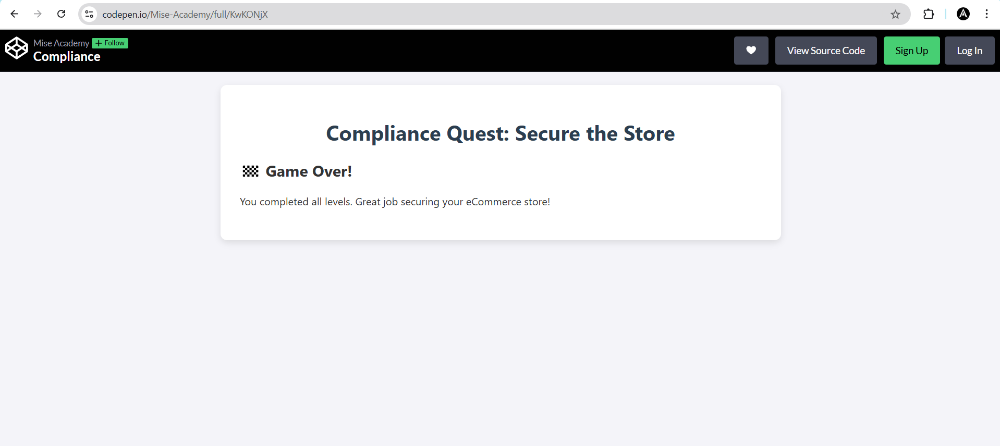
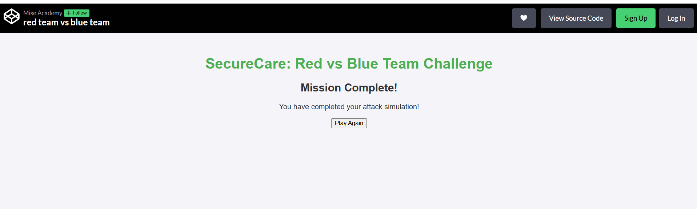

# Class 12 – Security Compliance (IT & Japanese Language Course)

Welcome to the Class 12 recap of the **IT & Japanese Language Course**, supported by **Plus W**, **Pak-Japan Centre**, **AOTS**, and **OEC**.  
This class focused on building a **security-first mindset** through real-world examples, compliance standards, and a hands-on gamified simulation.

---

## 🧠 Topics Covered

- Importance of Security Compliance
- Types of Security: Physical, Network, Cloud, Application, Data
- Red Team vs Blue Team
- Famous Case Studies: Equifax, Capital One, HIPAA
- Standards & Frameworks:  
  - **ISO 27001**  
  - **GDPR**  
  - **HIPAA**  
  - **NIST**  
- Compliance process & tools:
  - AWS Compliance Hub
  - Qualys, Snyk, etc.
- Hands-on Web Game: **Compliance Quest: Secure the Store**

---

## 🕹️ Hands-on Activities

### 🛡️ Compliance Quest: Secure the Store
An interactive browser game where we secured an eCommerce store by applying real-world compliance steps.

🔗 [Play the game here](https://codepen.io/Mise-Academy/full/KwKONjX)

---

### ⚔️ Red Team vs Blue Team Game
We role-played the offensive and defensive sides of security:  
- **Red Team** simulated hackers, exploiting vulnerabilities  
- **Blue Team** responded with patches, monitoring, and policy enforcement  

This exercise helped reinforce the real-world stakes of non-compliance and sharpened our understanding of layered defense.

🔗 [Play the game here](https://codepen.io/Mise-Academy/full/pvoMNYW)

---

## 💡 Key Takeaways

> Security is not a product — it’s a mindset.  
> Compliance is not a formality — it’s protection.

---

## 📂 Repository Content

- `README.md` – This file  
- `redvsblue.png` – Red vs Blue Team Simulation
- `compliance.png` – Final game over screen of the compliance quest  

---

## 🙌 Special Thanks

Thanks to the instructors, peers, and organizers for making this session interactive and practical.