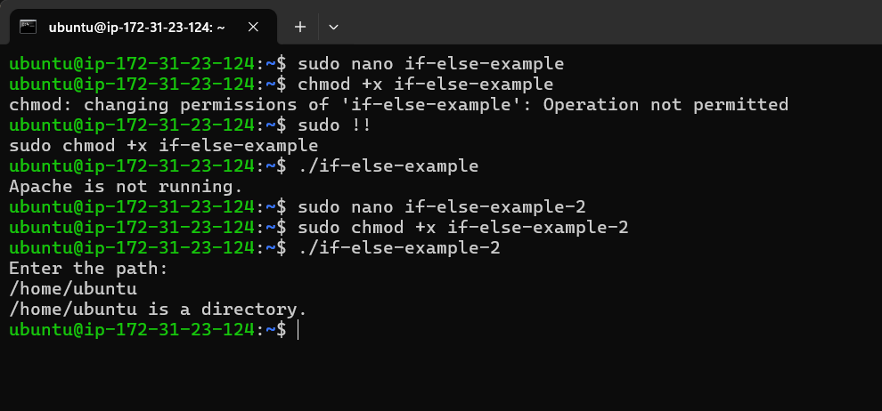
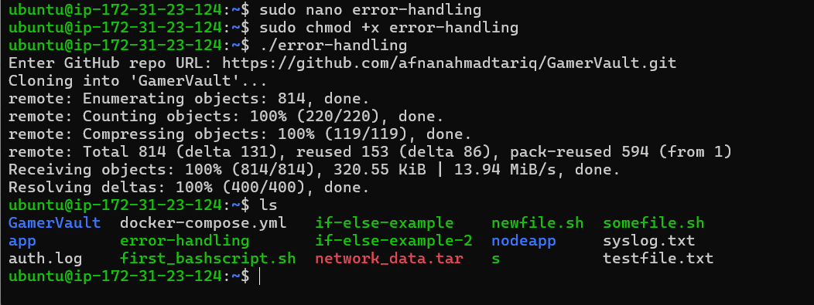
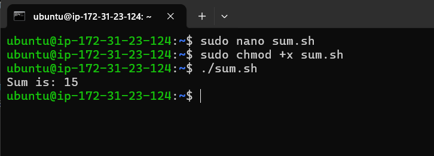
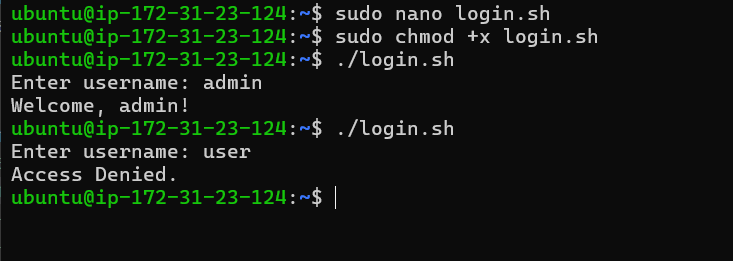

# 🛠️ Assignment 16 — Bash Scripting Language and GitHub

## 📚 Overview
This assignment covers bash scripting fundamentals including conditional statements, error handling, functions, and user authentication scripts.

---

## 🔍 If-Else Examples

### Example 1: Apache Service Status Check

```bash
#!/bin/bash
if systemctl is-active --quiet apache; then
    echo "Apache is running."
else
    echo "Apache is not running."
fi
```

### Example 2: Path Type Checker

```bash
#!/bin/bash
# Get the input path from the user
echo "Enter the path:"
read path

# Check if it's a file
if [ -f "$path" ]; then
    echo "$path is a file."
# Check if it's a directory
elif [ -d "$path" ]; then
    echo "$path is a directory."
# If it doesn't exist
else
    echo "$path does not exist."
fi
```



---

## ⚠️ Error Handling

### GitHub Repository Clone with Directory Check

```bash
#!/bin/bash
read -p "Enter GitHub repo URL: " url
dir=$(basename -s .git "$url")

if [ -d "$dir" ]; then
    echo "Directory '$dir' already exists. Skipping clone."
else
    git clone "$url"
fi
```



---

## 📝 Tasks

### 🧮 Task 1: Addition Function
**Objective:** Create a script with a function that adds two numbers.

**Instructions:** Create `sum.sh`

```bash
#!/bin/bash
add() {
    local sum=$(( $1 + $2 ))
    echo "Sum is: $sum"
}

# Call the function with arguments
add 5 10
```



### 🔐 Task 2: User Authentication Script
**Objective:** Create a bash script named `login.sh` that asks the user to enter a username.

**Requirements:**
- If the username is `admin`, display: **Welcome, admin!**
- If the username is anything else, display: **Access Denied**

```bash
#!/bin/bash
read -p "Enter username: " user

if [ "$user" = "admin" ]; then
    echo "Welcome, admin!"
else
    echo "Access Denied."
fi
```



---

## 🎯 Key Learning Points

- ✅ Conditional statements (`if`, `elif`, `else`)
- ✅ User input handling with `read`
- ✅ Function creation and parameter passing
- ✅ Error handling and directory checking
- ✅ String comparison in bash
- ✅ Local variables in functions

---

**📅 Assignment Completed:** Class 16 - Bash Scripting Fundamentals