# 🛠️ Assignment 17 — Docker and Docker Compose

## 📚 Overview
This assignment covers Docker fundamentals, containerization, and Docker Compose for multi-container applications.

---

## 🐳 Docker Tasks

### 🌟 Practical Example 1: Basic Docker Commands

#### Example 1: Hello World Container

**Commands:**
```bash
# 1. Install docker in your AWS server
# 2. Pull hello-world image
sudo docker pull hello-world

# 3. List running containers
sudo docker ps

# 4. List all images
sudo docker images

# 5. Run hello-world container
sudo docker run hello-world
```
**📸 Screenshots:**
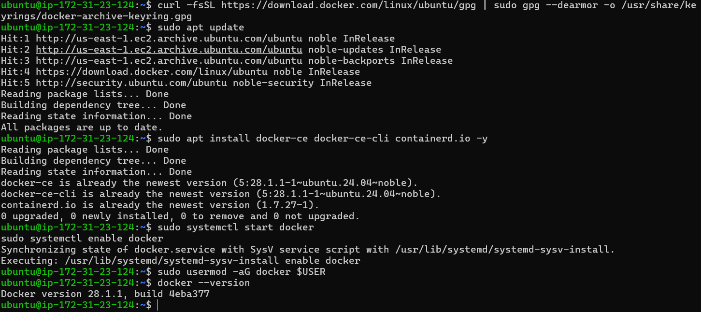
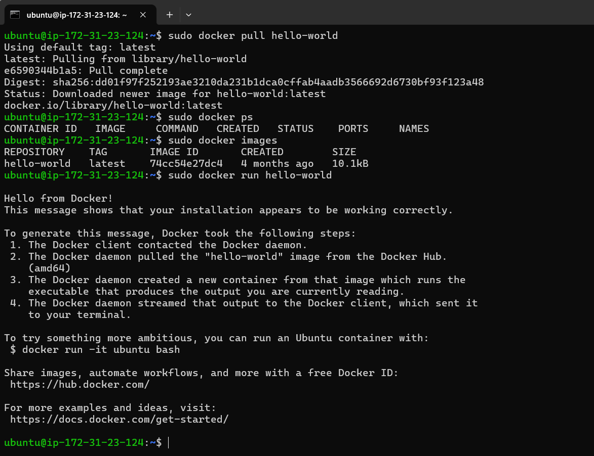

#### Example 2: Nginx Web Server

**Commands:**
```bash
# 1. Install docker in your AWS server
sudo apt install docker.io

# 2. Pull nginx image
sudo docker pull nginx

# 3. List running containers
sudo docker ps

# 4. List all images
sudo docker images

# 5. Run nginx container with port mapping
sudo docker run -p 5000:80 nginx
```

**📸 Screenshot:**
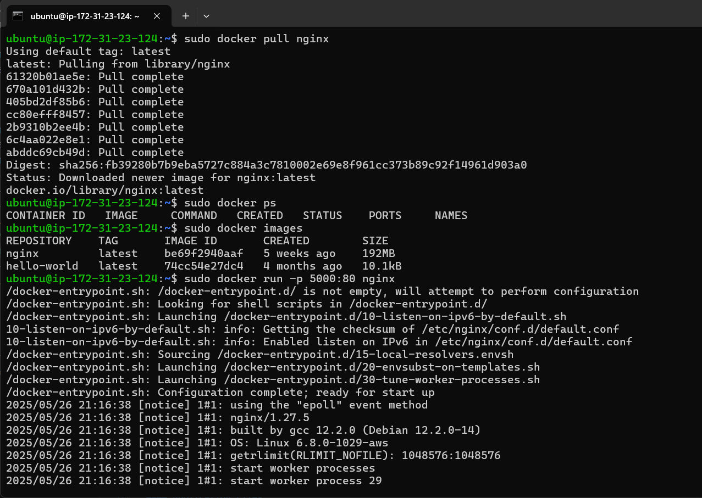

---

### 🐍 Practical Example 2: Flask Application

#### Application Files

**app.py**
```python
from flask import Flask

app = Flask(__name__)

@app.route('/')
def home():
    return "Hello from Flask in Docker!"

if __name__ == '__main__':
    app.run(host='0.0.0.0', port=8000)
```

**requirements.txt**
```txt
flask
```

**Dockerfile**
```dockerfile
FROM python:3.11-slim
WORKDIR /app
COPY . .
RUN pip install --no-cache-dir -r requirements.txt
EXPOSE 8000
CMD ["python", "app.py"]
```

#### Commands

**Setup and Installation:**
```bash
# 1. Create directory
mkdir app-python
cd app-python

# 2. Install docker in your AWS server

# 3. Create dockerfile
sudo vi Dockerfile

# 4. Build Docker image
sudo docker build -t python_app .

# 5. List images
sudo docker images

# 6. Run container
sudo docker run -p 8000:8000 python_app

# 7. List running containers
sudo docker ps
```
**📸 Screenshots:**
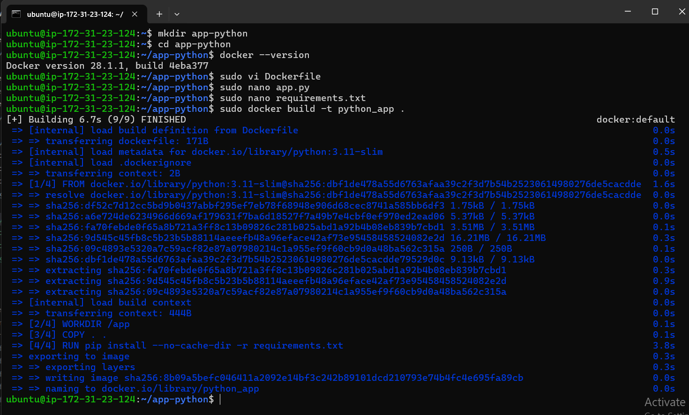
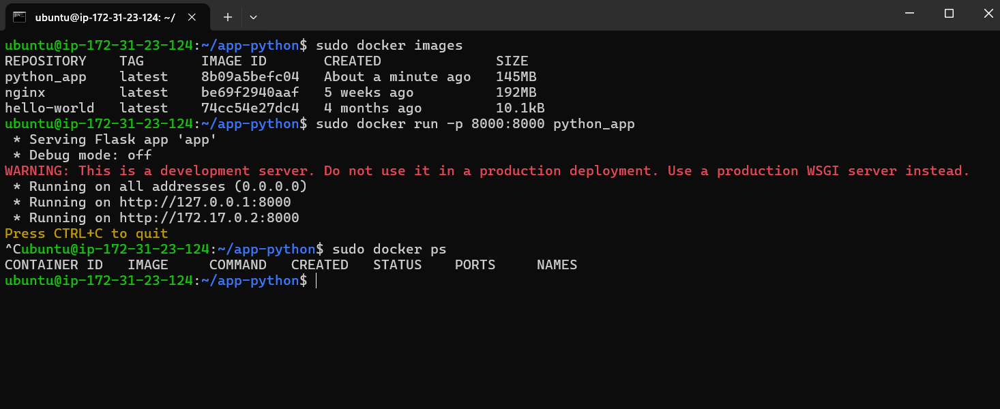

**Install Requirements (Step by step):**
```bash
# 1. Update system
sudo apt update

# 2. Install Python dependencies
sudo apt install python3-venv python3-pip

# 3. Create virtual environment
python3 -m venv app_env

# 4. Activate virtual environment
source app_env/bin/activate

# 5. Install Flask
pip install flask
```

**📸 Screenshot:**
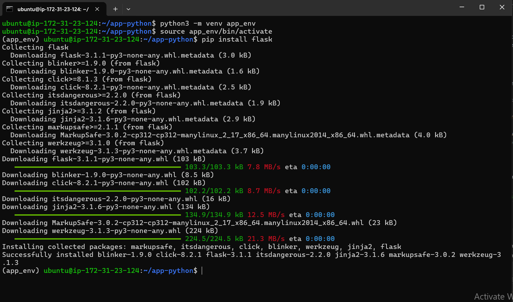

---

### 🟢 Practical Example 3: Node.js Application

#### Application Files

**index.js**
```javascript
const express = require('express');
const app = express();

app.get('/', (req, res) => {
    res.send('Hello from Node.js Express!');
});

app.listen(3000, () => {
    console.log('Node app listening on port 3000');
});
```

**package.json**
```json
{
    "name": "node-app",
    "version": "1.0.0",
    "main": "index.js",
    "scripts": {
        "start": "node index.js"
    },
    "dependencies": {
        "express": "^4.18.2"
    }
}
```

**Dockerfile**
```dockerfile
FROM node:18-alpine
WORKDIR /app
COPY . .
RUN npm install
EXPOSE 3000
CMD ["node", "index.js"]
```

#### Commands

```bash
# 1. Create directory
mkdir node-app
cd node-app

# 2. Install docker in your AWS server

# 3. Create dockerfile
sudo vi Dockerfile

# 4. Build Docker image
sudo docker build -t node_app .

# 5. List running containers
sudo docker ps

# 6. List images
sudo docker images

# 7. Run container
sudo docker run -p 3000:3000 node_app
```
**📸 Screenshots:**
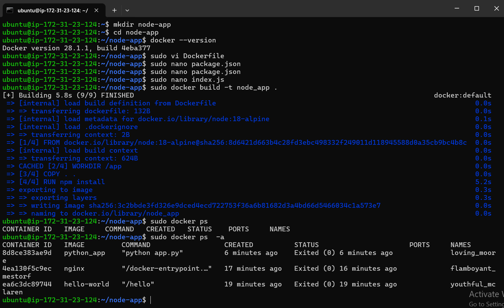
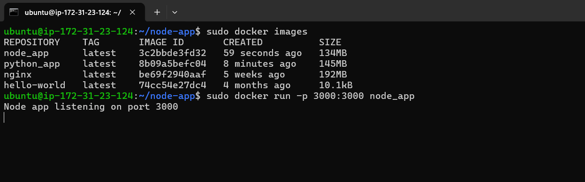

**Install Requirements (Step by step):**
```bash
# 1. Update system
sudo apt update

# 2. Install Node.js dependencies
sudo apt install nodejs npm

# 3. Initialize npm project
npm init -y

# 4. Install express
npm install express
```

**📸 Screenshot:**
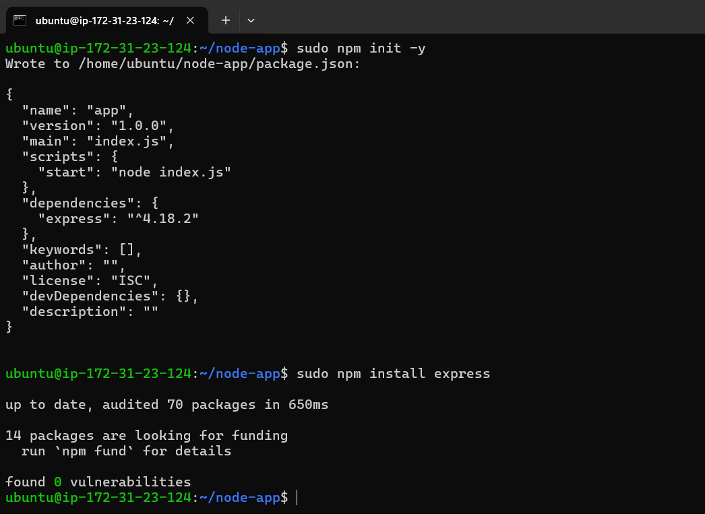

---

## 🐳 Docker Compose Tasks

### 🌟 Practical Example 1: Single Service

**docker-compose.yml**
```yaml
version: "3.8"
services:
  python-app:
    build: .
    container_name: myfirst_app
    ports:
      - "8000:8000"  # Map host port
```

**📸 Screenshot:**
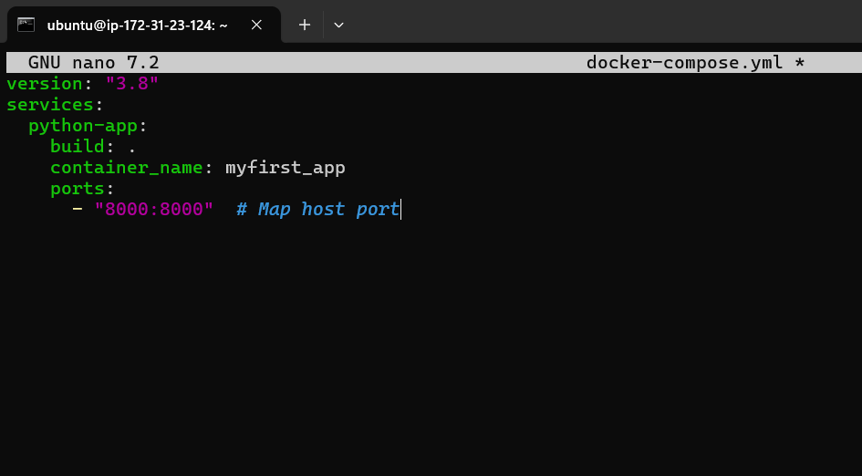
---

### 🌟 Practical Example 2: Multi-Service

**docker-compose.yml**
```yaml
version: "3.8"
services:
  python-app:
    build:
      context: ./app-python
    ports:
      - "8000:8000"
  
  node-app:
    build:
      context: ./node-app
    ports:
      - "3000:3000"
```
**📸 Screenshot:**
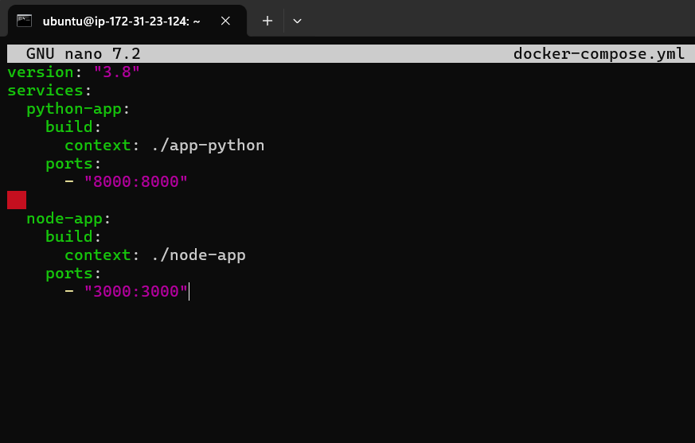
---

#### Run Docker Compose

**Start, stop, and view logs:**
```bash
# Start containers
docker-compose up

# Stop and remove containers
docker-compose down

# View logs
docker-compose logs

# Run in background (detached mode)
docker-compose up -d
```

**📸 Screenshot:**
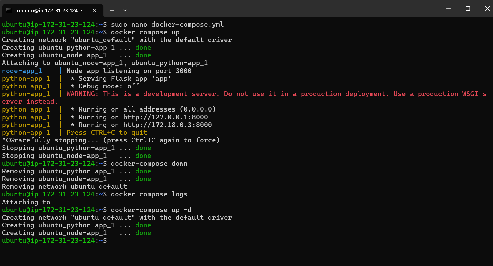

---

## 📝 Tasks

### 🎯 Task 1: Simple docker-compose.yml

**Objective:** Create a Simple docker-compose.yml file

**Instructions:**
- Create a `docker-compose.yml` file
- Add version '3'
- Define a service `web` using the nginx image
- Expose port 8080 on the host and map it to 80 in the container

**Solution:**
```yaml
version: '3'
services:
  web:
    image: nginx
    ports:
      - "8080:80"
```

**📸 Screenshots:**
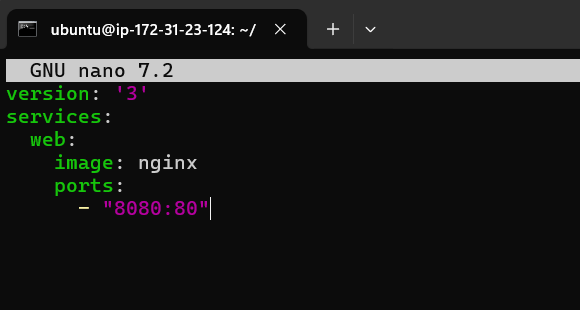
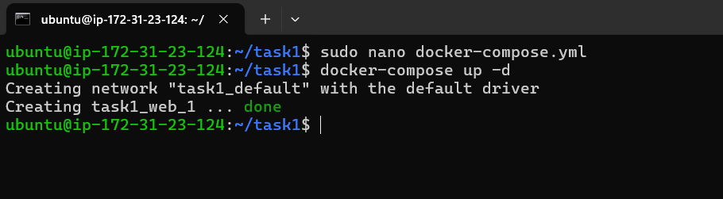

---

### 🎯 Task 2: Multi-container App (Web + DB)

**Objective:** Create Multi-container App (Web + Database)

**Instructions:** Create `docker-compose.yml`

**Solution:**
```yaml
version: '3'
services:
  web:
    image: nginx
    ports:
      - "8080:80"
  
  db:
    image: mysql
    environment:
      MYSQL_ROOT_PASSWORD: root123
```

**📸 Screenshots:**
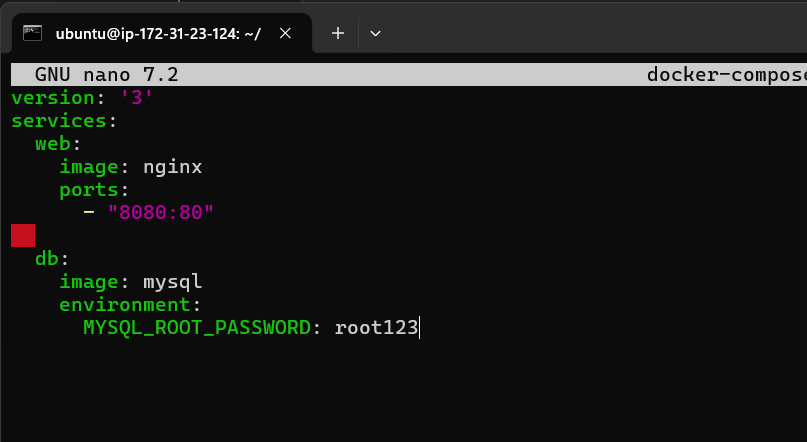
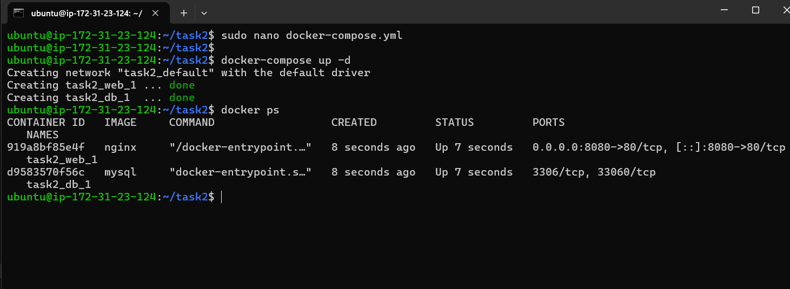

---

## 🎯 Key Learning Points

- ✅ Docker installation and basic commands
- ✅ Creating Dockerfiles for different applications
- ✅ Building and running Docker containers
- ✅ Port mapping and container networking
- ✅ Docker Compose for multi-container applications
- ✅ Environment variables in containers
- ✅ Container orchestration basics

---

## 📋 Commands Summary

### Essential Docker Commands
```bash
# Image management
docker pull <image>
docker images
docker build -t <tag> .

# Container management
docker run -p <host-port>:<container-port> <image>
docker ps
docker ps -a
docker stop <container>
docker rm <container>

# Docker Compose
docker-compose up
docker-compose down
docker-compose logs
docker-compose up -d
```

---

**📅 Assignment Completed:** Class 17 - Docker and Docker Compose Fundamentals
