# 🛠️ Assignment 18 — Containerize the web application by Using AWS, GitHub and Docker

This guide outlines the steps to deploy a Django web application on an AWS EC2 instance, including cloning a GitHub repository, setting up the environment, creating a Docker container, and configuring security group rules for global access.

## Prerequisites
- AWS account with access to EC2
- GitHub repository: [https://github.com/shreys7/django-todo](https://github.com/shreys7/django-todo)
- Basic knowledge of Linux commands and SSH
- Python 3 and Docker installed on your local machine for testing (optional)

## Step 1: Launch an EC2 Instance
1. Log in to the AWS Management Console and navigate to the EC2 Dashboard.
2. Click **Launch Instance**.
3. Choose an Amazon Linux 2 AMI (or Ubuntu Server 20.04 LTS).
4. Select an instance type (e.g., `t2.micro` for free tier).
5. Configure instance details (default settings are usually fine).
6. Add storage (8 GB is sufficient for this project).
7. Create or select an existing key pair for SSH access (e.g., `my-key.pem`).
8. Launch the instance and note the public IP address.

## Step 2: SSH into the EC2 Instance
1. Open a terminal on your local machine.
2. Connect to the EC2 instance:
   ```bash
   ssh -i my-key.pem ec2-user@<your-ec2-public-ip>
   ```
   Replace `<your-ec2-public-ip>` with the instance’s public IP.

## Step 3: Set Up the Environment on EC2
1. Update the system packages:
   ```bash
   sudo apt update && sudo apt upgrade -y
   ```
2. Install Python 3 and pip:
   ```bash
   sudo apt install python3 python3-pip python3-venv -y 
   ```
3. Install Git:
   ```bash
   sudo apt install git -y
   ```

   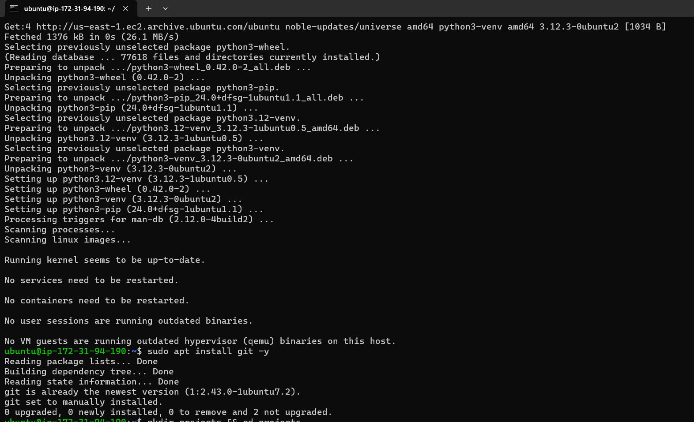

## Step 4: Clone the GitHub Repository
1. Create a directory for the project:
   ```bash
   mkdir projects && cd projects
   ```
2. Clone the Django project:
   ```bash
   git clone https://github.com/shreys7/django-todo.git
   ```
3. Navigate to the project directory:
   ```bash
   cd django-todo
   ```

   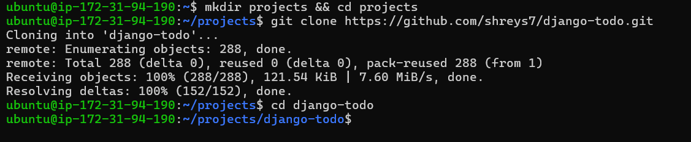

## Step 5: Set Up a Virtual Environment
1. Create a virtual environment:
   ```bash
   python3 -m venv myenv
   ```
2. Activate the virtual environment:
   ```bash
   source myenv/bin/activate
   ```
3. Install Django:
   ```bash
   pip install django==3.2
   ```

   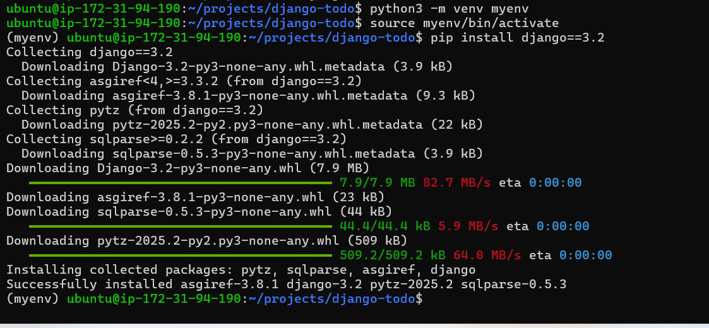

## Step 6: Run the Django Project Locally on EC2
1. Apply database migrations:
   ```bash
   python3 manage.py makemigrations
   python3 manage.py migrate
   ```
2. Start the Django development server:
   ```bash
   python3 manage.py runserver 0.0.0.0:8001
   ```
   **Note**: The server runs on port 8001 and is accessible locally at `http://127.0.0.1:8001`.

   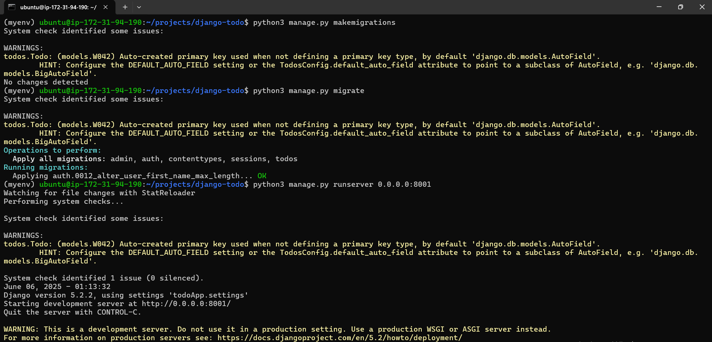

## Step 7: Configure Security Group Rules
To make the application accessible globally, update the EC2 instance's security group:
1. Go to the AWS EC2 Dashboard.
2. Select your instance and click on the associated security group (e.g., `launch-wizard-4`).
3. Go to **Inbound Rules** and click **Edit Inbound Rules**.
4. Add a new rule:
   - **Type**: Custom TCP
   - **Port Range**: 8001
   - **Source**: 0.0.0.0/0 (allows access from any IP)
5. Save the changes.

   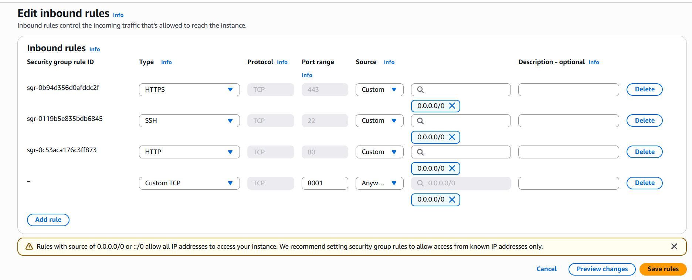
   
   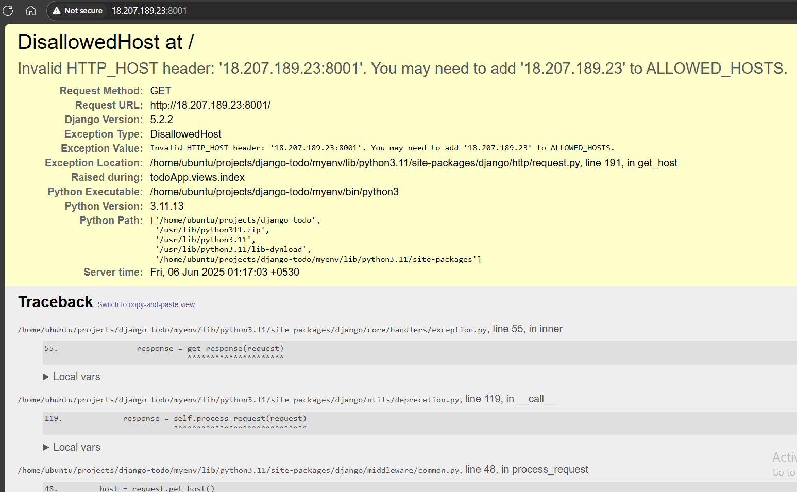

## Step 8: Fix Django ALLOWED_HOSTS
1. Open the Django settings file:
   ```bash
   vi todoApp/settings.py
   ```
2. Find the `ALLOWED_HOSTS` line and update it:
   ```python
   ALLOWED_HOSTS = ['18.207.189.23', 'localhost']
   ```
   Alternatively, for testing, use:
   ```python
   ALLOWED_HOSTS = ['*']
   ```
3. Save and exit the file.
4. Restart the Django server:
   ```bash
   python3 manage.py runserver 0.0.0.0:8001
   ```

   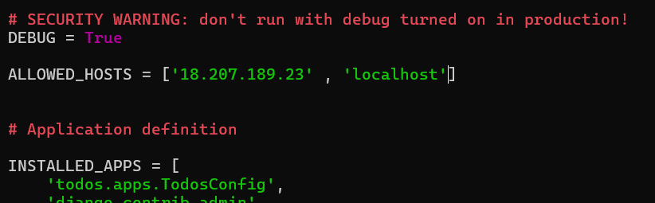
   
   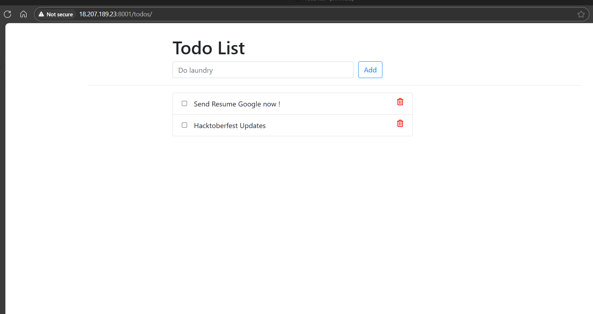
   
   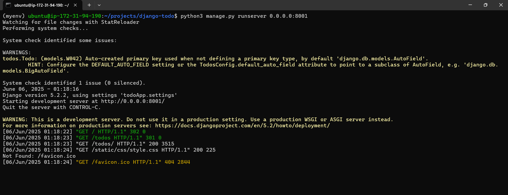

## Step 9: Create a Dockerfile
To containerize the application, create a Dockerfile in the project directory.
1. Create the Dockerfile:
   ```bash
   vi Dockerfile
   ```
2. Add the following content:
    ```bash
    FROM python:3.8
    WORKDIR /app
    COPY . .
    RUN pip install django==3.2
    RUN python manage.py migrate
    CMD ["python", "manage.py", "runserver", "0.0.0.0:8001"]
    ```

   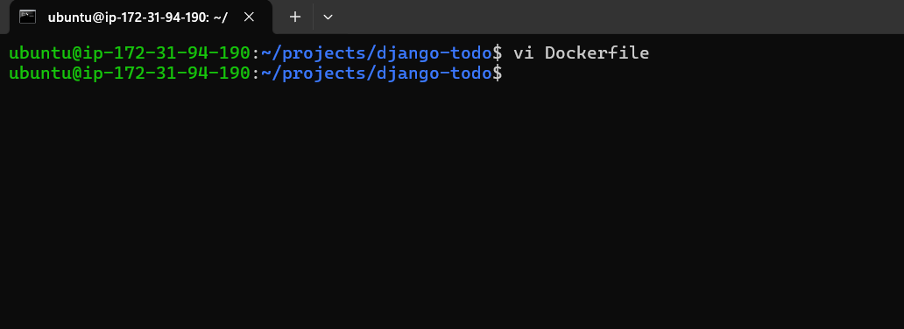
   
   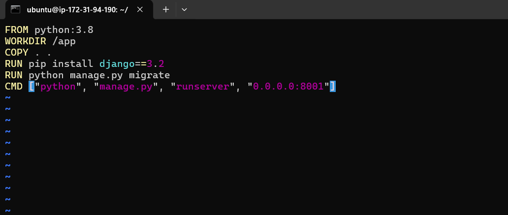

## Step 10: Install Docker on EC2
1. Install Docker:
   ```bash
   sudo apt-get install docker.io -y
   ```
2. Start Docker and enable it to run on boot:
   ```bash
   sudo systemctl start docker
   sudo systemctl enable docker
   ```
3. Add the `ec2-user` (or `ubuntu` user) to the Docker group:
   ```bash
   sudo usermod -aG docker ubuntu
   ```
4. Log out and back in to apply group changes:
   ```bash
   exit
   ssh -i my-key.pem ec2-user@<your-ec2-public-ip>
   ```

   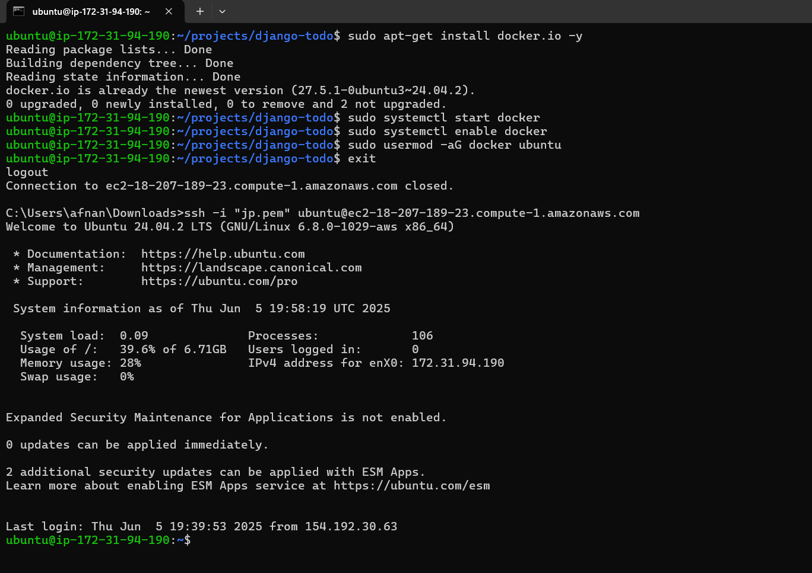

## Step 11: Build and Run the Docker Image
1. Build the Docker image:
   ```bash
   docker build -t todo-app .
   ```
2. Run the Docker container:
   ```bash
   docker run -p 8001:8001 todo-app
   ```

   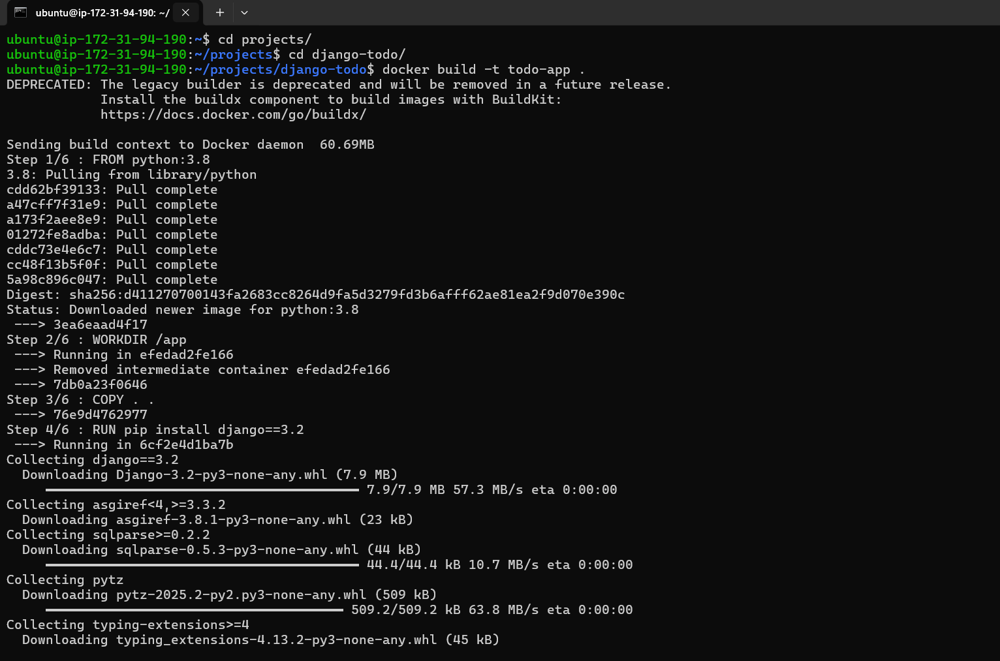
   
   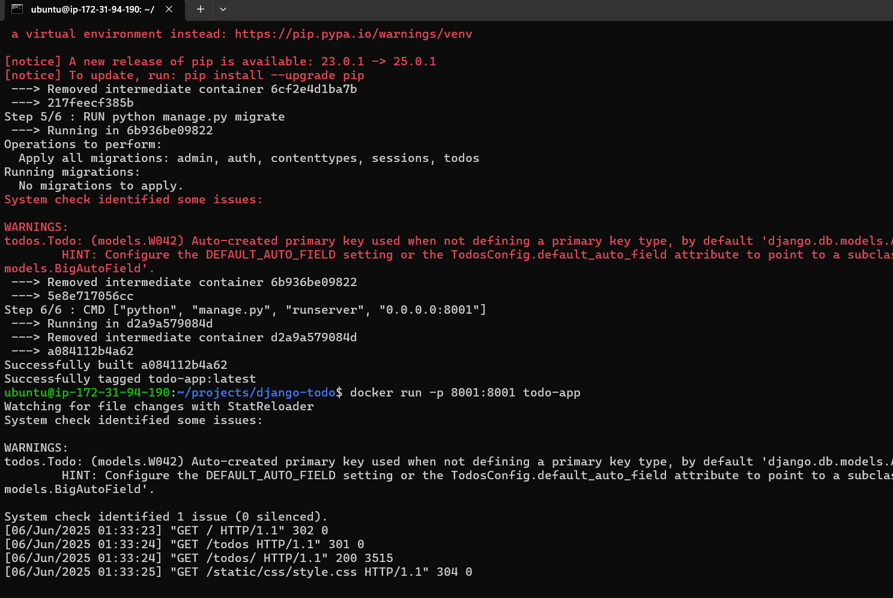

## Step 12: Access the Application
- Open a browser and navigate to `http://<your-ec2-public-ip>:8001`.
- The Django application should now be accessible globally.

   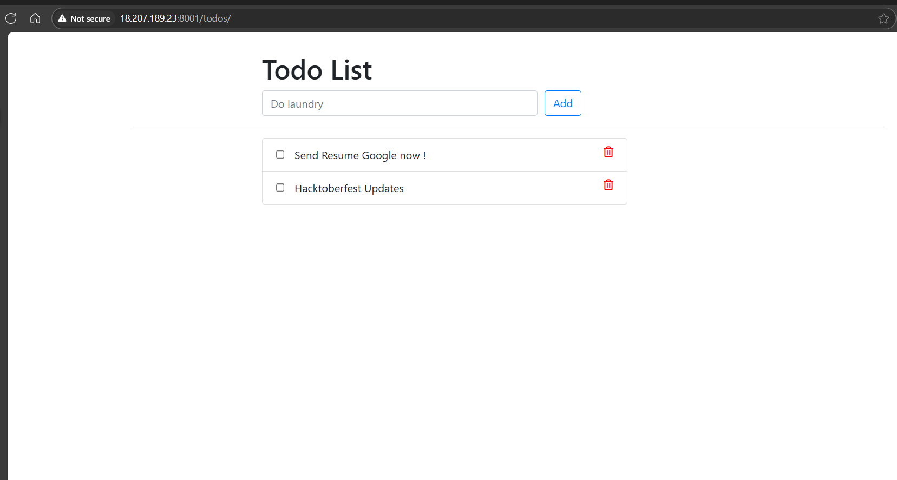

## Troubleshooting
- **Disallowed Host Error**: Ensure `ALLOWED_HOSTS` includes your EC2 public IP or use `['*']` for testing.
- **Port Not Accessible**: Verify the security group rule for port 8001 is set to `0.0.0.0/0`.
- **Docker Issues**: Ensure Docker is running (`systemctl status docker`) and the user is in the Docker group.
