# Assignment 19: IT Automation with Ansible and YAML

---

## 1. Launch EC2 Instances

- Created **Control Node** and **Managed Node(s)** on AWS EC2.
- Downloaded SSH key pair.

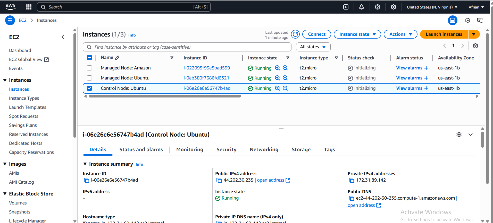

---

## 2. Connect to Control Node

Connect via SSH:
```bash
ssh -i "jp.pem" ubuntu@ec2-44-202-30-235.compute-1.amazonaws.com
```
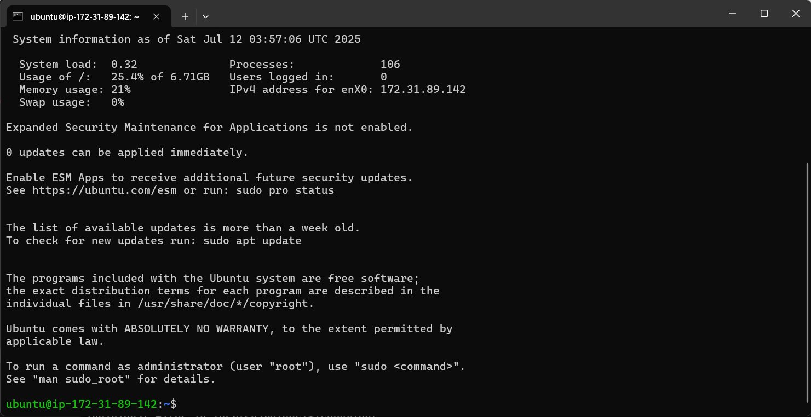

---

## 3. Update and Install Ansible

**Ubuntu:**
```bash
sudo apt update
sudo apt install ansible
```

**Amazon Linux 2:**
```bash
sudo yum update
sudo amazon-linux-extras install epel
sudo yum install ansible
```

Verify installation:
```bash
ansible --version
```
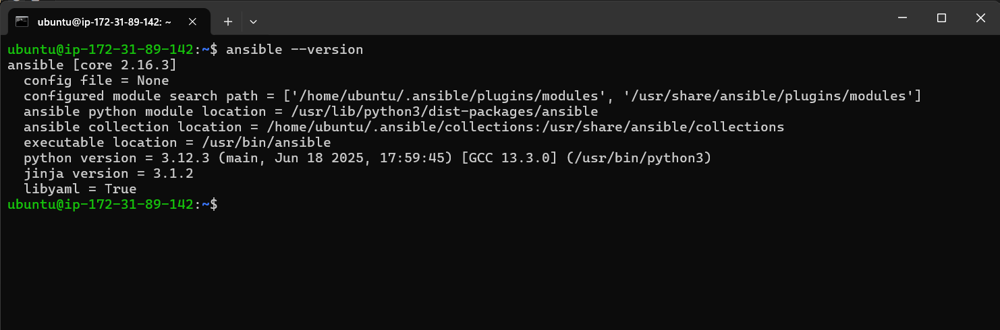

---

## 4. Upload Keys for Managed Nodes

Upload the key and set permissions:
```bash
scp -i jp.pem jp.pem ubuntu@ec2-44-202-30-235.compute-1.amazonaws.com:/home/ubuntu
chmod 600 jp.pem
```
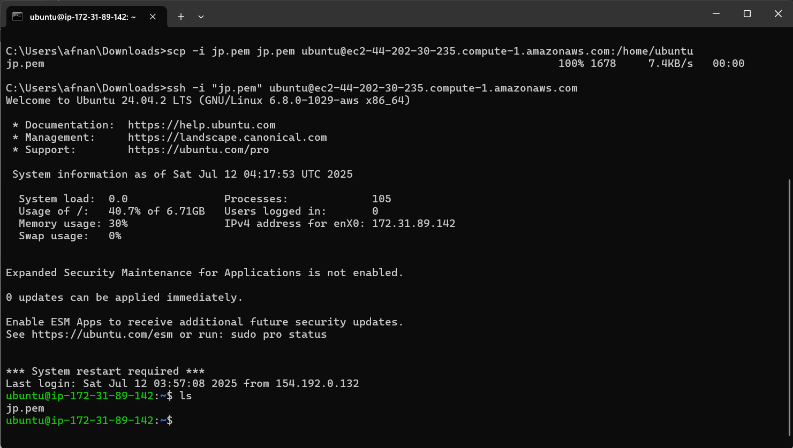
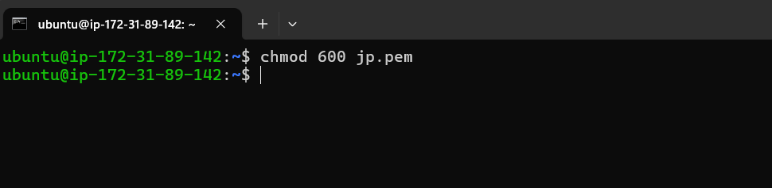

---

## 5. Create Ansible Inventory

Create `inventory.yml`:
```yaml
all:
  hosts:
    server1:
      ansible_host: 44.212.28.95
      ansible_user: ubuntu
      ansible_ssh_private_key_file: jp.pem
    server2:
      ansible_host: 3.84.210.145
      ansible_user: ec2-user
      ansible_ssh_private_key_file: jp.pem
```
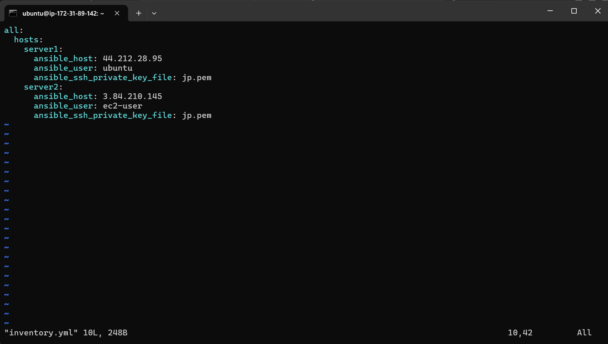

---

## 6. Create Playbooks

### install_nginx_play.yml

```yaml
- name: Install and start nginx
  hosts: all
  become: yes
  tasks:
    - name: install nginx
      apt:
        name: nginx
        state: latest
    - name: start nginx
      service:
        name: nginx
        state: started
        enabled: yes
```
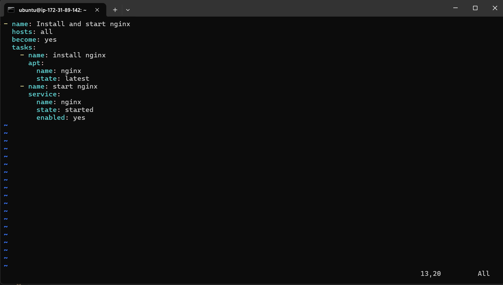

---

### install_docker.yml

```yaml
- name: Install Docker on Ubuntu and Amazon Linux
  hosts: all
  become: true
  tasks:
    - name: Install Docker on Ubuntu
      apt:
        name: docker.io
        state: latest
        update_cache: true
      when: ansible_distribution == "Ubuntu"
    - name: Start and enable Docker service on Ubuntu
      service:
        name: docker
        state: started
        enabled: yes
      when: ansible_distribution == "Ubuntu"
    - name: Install Docker on Amazon Linux
      yum:
        name: docker
        state: latest
      when: ansible_distribution == "Amazon"
    - name: Start and enable Docker service on Amazon Linux
      service:
        name: docker
        state: started
        enabled: yes
      when: ansible_distribution == "Amazon"
```
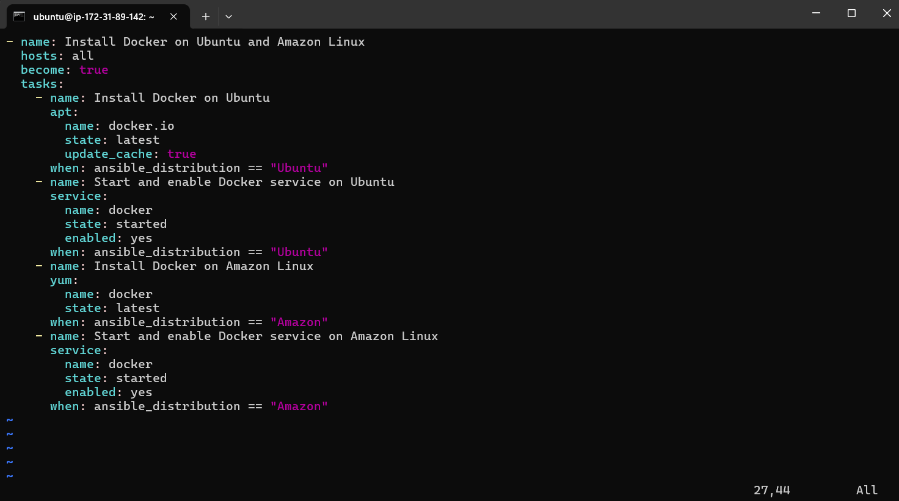

---

## 7. Run Playbooks

Run the playbooks:
```bash
ansible-playbook -i inventory.yml install_nginx_play.yml --limit server1
ansible-playbook -i inventory.yml install_docker.yml
```
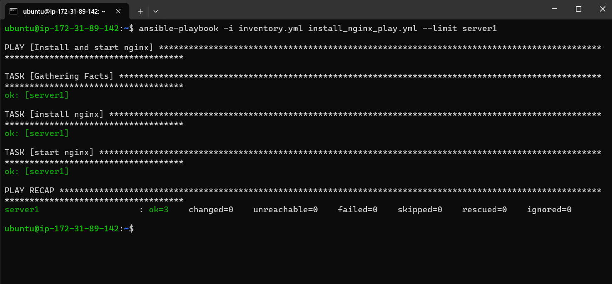
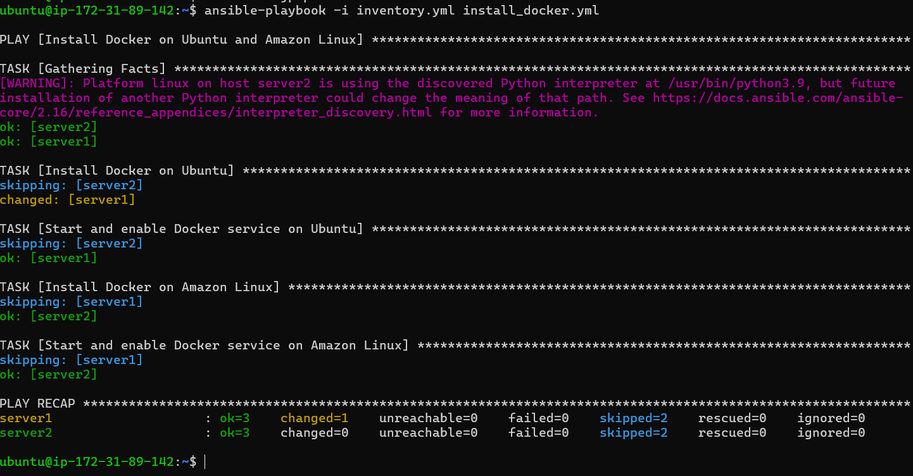

---

## 8. Validation

Check nginx and docker status on managed nodes:
```bash
ansible -i inventory.yml server1 -m shell -a "systemctl status nginx"
ansible -i inventory.yml all -m shell -a "systemctl status docker"
```
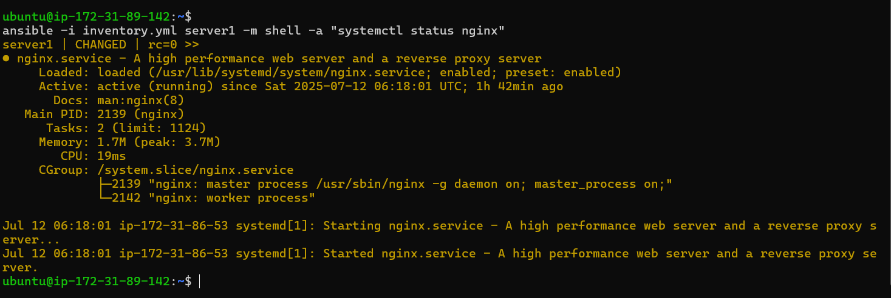
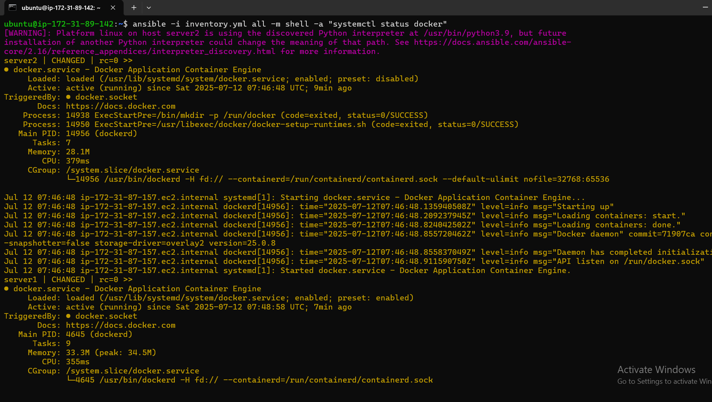

---