# Assignment 20: Introduction of Django

## Steps to Deploy Django Blog Project on AWS EC2

1. **Launch EC2 Instance**
   - Create an Ubuntu EC2 instance on AWS.
   - 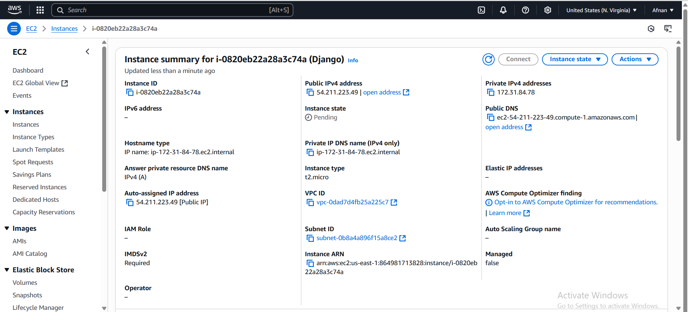

2. **Connect to EC2 and Update Packages**
   - SSH into your EC2 instance.
   - Run:
     ```
     sudo apt update
     ```
   - 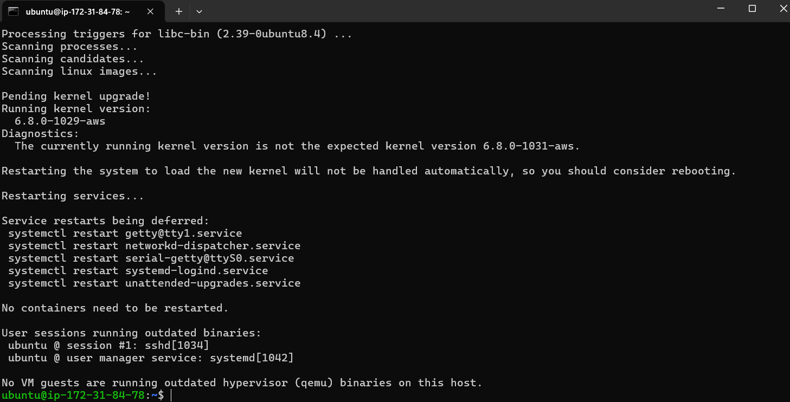

3. **Install Python, pip, virtualenv, and Git**
   - Run:
     ```
     sudo apt install python3-pip python3-venv git -y
     ```

4. **Create Python Virtual Environment**
   - Run:
     ```
     python3 -m venv env
     ```
   - 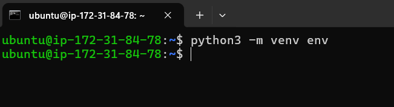

5. **Activate Virtual Environment**
   - Run:
     ```
     source env/bin/activate
     ```
   - 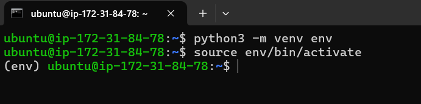

6. **Install Django**
   - Run:
     ```
     pip install django
     ```
   - 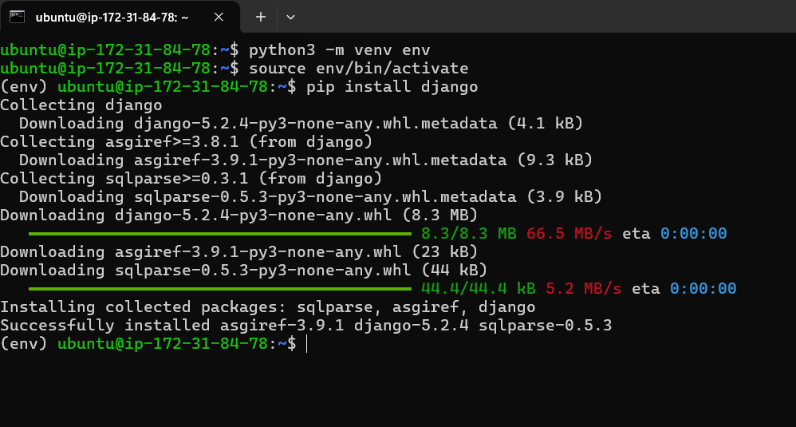

7. **Clone the Django Blog Repository**
   - Run:
     ```
     git clone https://github.com/tomitokko/django-blog.git
     ```
   - 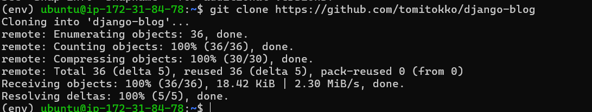

8. **Run Migrations**
   - Run:
     ```
     cd django-blog
     python manage.py makemigrations
     python manage.py migrate
     ```
   - 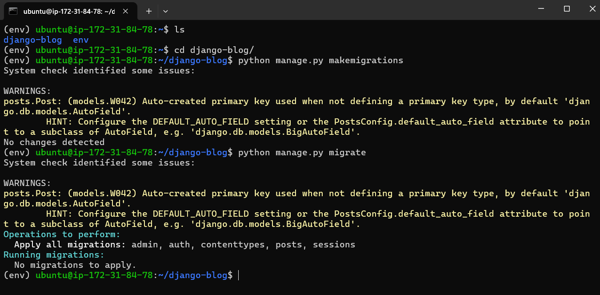

9. **Run Django Development Server**
    - Run:
      ```
      python manage.py runserver 0.0.0.0:8000
      ```
    - 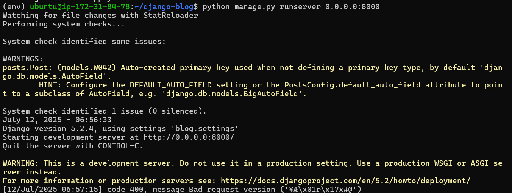

10. **Access Application in Browser**
    - Visit: `http://54.211.223.49:8000`
    
    - 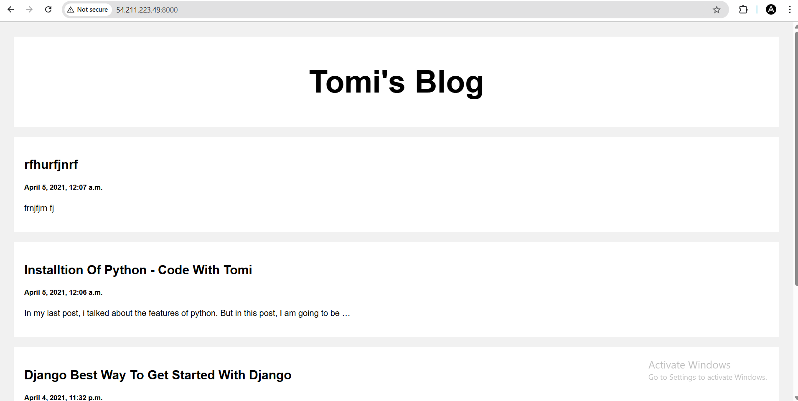

11. **Install Docker**
    - Run:
      ```
      sudo apt install docker.io -y
      ```
    - 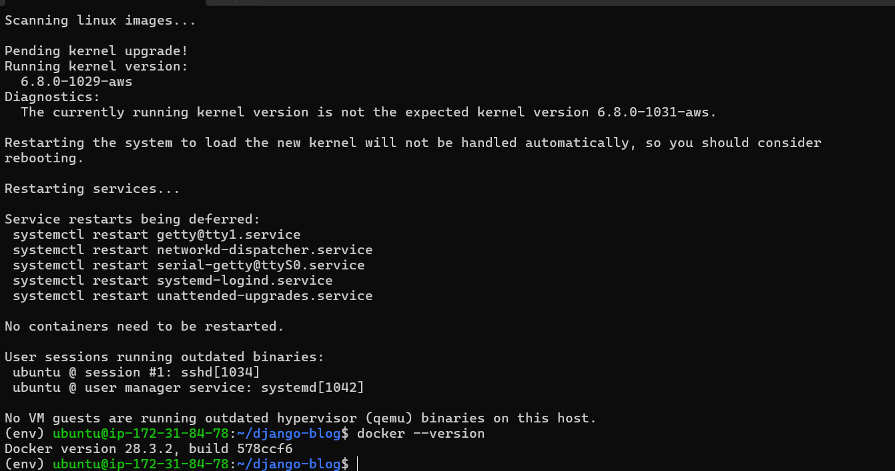

12. **Write Dockerfile**
    - Create a `Dockerfile` for your Django project.

    - .png>)

13. **Build Docker Image**
    - Run:
      ```
      docker build -t django-blog .
      ```
    - 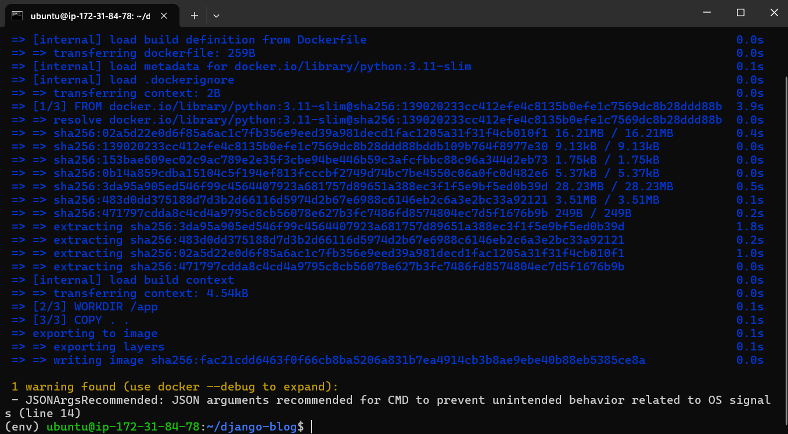

14. **Configure Security Group**
    - In AWS Console, add an inbound rule to allow TCP traffic on port 8000.

15. **Add IP Address**
    - Add EC2 public IP to `ALLOWED_HOSTS` in `settings.py`.

16. **Run Docker Container**
    - Run:
      ```
      docker run -p 8000:8000 django-blog
      ```
    - 

---