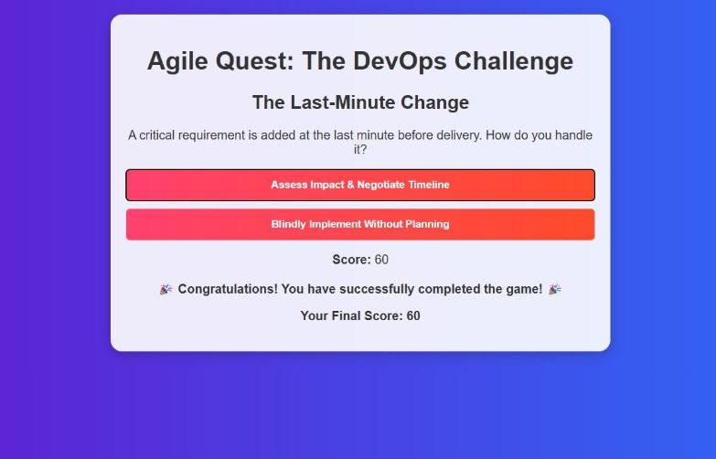

# Class 9 Activity: Agile Quest - The DevOps Challenge

## 📚 Overview

In this class, we explored the *Agile Quest: The DevOps Challenge*, a gamified learning module aimed at reinforcing critical DevOps decision-making skills. The challenge presented various real-world scenarios where quick thinking and agile principles had to be applied effectively.

---

## 🎯 Objective

To understand and apply agile decision-making in high-pressure situations and evaluate the implications of those decisions on project timelines and delivery.

---

## 🕹️ Activity Highlight

### Scenario: The Last-Minute Change

> A critical requirement is added at the last minute before delivery. How do you handle it?

#### My Choice:
✅ **Assess Impact & Negotiate Timeline**

This option reflects a best practice in agile project management—ensuring that any new change is evaluated and timelines are adjusted based on feasibility and team capacity.

---

## 🏆 Outcome

- **Score:** `60`
- 🎉 Congratulations! You have successfully completed the game!
- **Final Score:** `60`

---

## 📝 Learnings

- Agile isn't about doing everything fast, it's about **doing things smartly and collaboratively**.
- Assessing risk, planning impact, and communicating openly are key.
- Blindly implementing changes without impact analysis can lead to technical debt and missed deadlines.

---

## 🔗 Additional Resources

- [Agile Manifesto](https://agilemanifesto.org/)
- [DevOps Best Practices](https://www.atlassian.com/devops)

